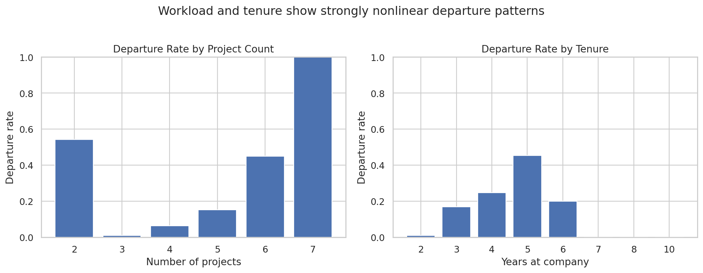
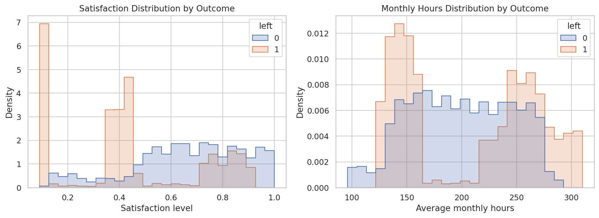
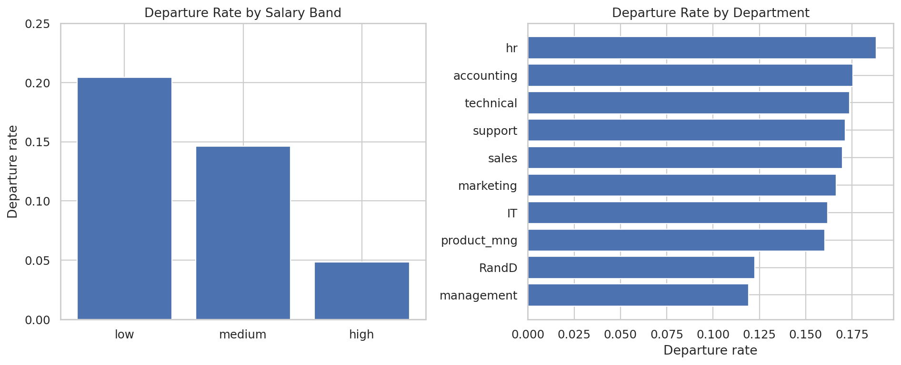
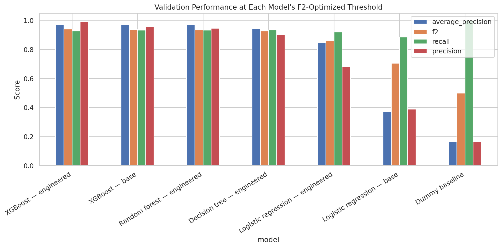
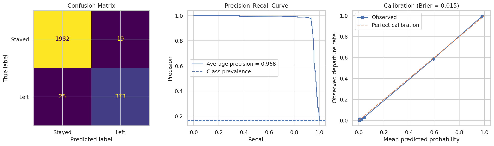
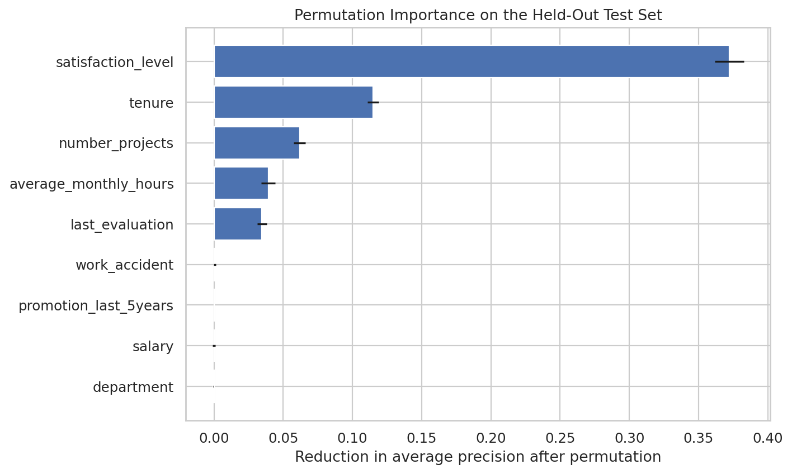
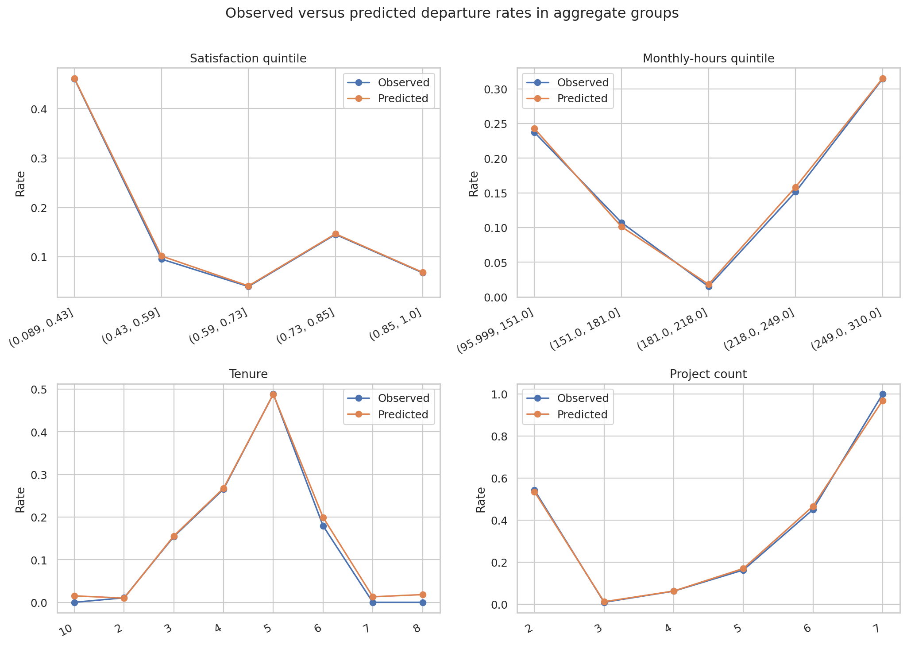

# Salifort Motors Employee Turnover Analysis

**Reproduction status:** Fresh-kernel rerun passed with Python 3.13.5 on
2026-07-30.

This case study analyzes workforce patterns associated with employee departure
in the Salifort Motors educational HR dataset. It validates the source data,
documents the class-balance effect of exact-row deduplication, compares
multiple classification approaches, selects an operating threshold using
validation data, and evaluates the selected model on a held-out test set.

## Business question

Which workforce patterns are most strongly associated with employee departure,
and how accurately can a classification model identify higher-risk records in
this educational dataset without overstating causal or production-readiness
claims?

## Project highlights

- Validated **14,999 rows and 10 columns** with no missing values.
- Identified **3,008 exact duplicate rows**.
- Documented the departure-rate change from **23.8% raw** to **16.6% after deduplication**.
- Preserved categorical `salary` as the only salary representation in modeling.
- Compared seven model/feature-set combinations.
- Tuned each classification threshold on the validation set using **F2**.
- Treated validation average-precision differences below **0.002** as practical ties.
- Selected **XGBoost — base** using the nine source predictors.
- Evaluated the champion once on a held-out test set.
- Added bootstrap uncertainty intervals, permutation importance, calibration, and subgroup error review.

## Data validation

| Stage | Rows | Stayed | Left | Departure rate |
|---|---:|---:|---:|---:|
| Raw | 14,999 | 11,428 | 3,571 | 23.8% |
| After exact-row deduplication | 11,991 | 10,000 | 1,991 | 16.6% |

Duplicate removal changes the observed class balance materially. Because the
dataset has no employee ID or timestamp, duplicate provenance cannot be
verified. Exact duplicates may be extraction artifacts, but the supplied
fields cannot prove they are not legitimate repeated states.

The verified source CSV is committed at
[`data/raw/HR_comma_sep.csv`](data/raw/HR_comma_sep.csv).

Kaggle lists the source dataset as CC0: Public Domain. The repository copy is
unchanged and has SHA-256
`af8c4cede39f28b5a67c748a66aa850fe260f908cbeaa226694121e0a9a4e105`.

Source, licensing, schema, and validation details are documented in
[`data/raw/README.md`](data/raw/README.md).

## Key descriptive findings

- Departure is strongly nonlinear by project count, with elevated rates at very low and very high workloads.
- Departure rises sharply around the 4–5 year tenure window.
- Employees who left have substantially lower satisfaction on average.
- Lower salary bands show higher departure rates than the high-salary band.
- Department differences exist, but are smaller than the strongest satisfaction, workload, tenure, and salary patterns.







## Model selection

The primary ranking metric is validation **average precision**. Thresholds are
selected separately for each model by maximizing **F2** on the validation
split.

The following models were practical ties within 0.002 average-precision points
of the validation leader:

- XGBoost — engineered
- XGBoost — base
- Random forest — engineered

The final selection is **XGBoost — base** because it was inside the
practical-tie band and used only the cleaned source predictors, avoiding
additional engineered assumptions. The threshold selected on validation data
was **0.265**.



## Held-out test results

| Metric | Value |
|---|---:|
| Accuracy | 98.2% |
| Precision | 95.2% |
| Recall | 93.7% |
| F1 | 94.4% |
| F2 | 94.0% |
| ROC-AUC | 0.9839 |
| Average precision | 0.9679 |
| Brier score | 0.0146 |
| Threshold | 0.265 |

Confusion-matrix counts: **1,982 true negatives, 19 false positives, 25 false
negatives, and 373 true positives**.



## Interpretability

Permutation importance ranked the strongest source features as:

1. `satisfaction_level`
2. `tenure`
3. `number_projects`
4. `average_monthly_hours`
5. `last_evaluation`





## Responsible interpretation

The high performance is credible as a result within this educational dataset,
but it is not evidence that a real-world turnover system would generalize
similarly. The dataset has no employee identifiers, dates, role levels,
managers, locations, or departure reasons. Voluntary and involuntary exits are
combined, and the timing of satisfaction and evaluation measurements is
unknown.

This work should support aggregate investigation, policy review, and
prospective testing of supportive interventions. It should not be used to
automate adverse employment decisions, rank employees for action, or make
causal claims.

## Repository structure

```text
salifort-motors-turnover-analysis/
├── README.md
├── requirements.txt
├── .python-version
├── .gitignore
├── .gitattributes
├── LICENSE
├── notebooks/
│   └── salifort_turnover_analysis.ipynb
├── data/
│   └── raw/
│       ├── README.md
│       └── HR_comma_sep.csv
├── images/
│   ├── observed_vs_predicted_profiles.png
│   ├── permutation_importance.png
│   ├── satisfaction_and_hours.png
│   ├── test_performance_summary.png
│   ├── turnover_by_projects_tenure.png
│   ├── turnover_by_salary_department.png
│   └── validation_model_comparison.png
├── models/
│   └── salifort_turnover_model_metadata.json
└── reports/
    ├── data_validation.md
    ├── executive_summary.md
    └── model_card.md
```

## Reproduce the analysis

1. Use Python 3.13.5.
2. Create and activate a virtual environment.
3. Install dependencies:

   ```bash
   pip install -r requirements.txt
   ```

4. Open `notebooks/salifort_turnover_analysis.ipynb`.
5. Restart the kernel and run all cells from top to bottom.

The notebook validates the committed raw file's schema, dimensions, target
counts, missing-value count, duplicate count, and SHA-256 fingerprint before
running the analysis.

The reported metrics were reproduced on Linux. With the same pinned Python and
package versions on Windows, XGBoost produced platform-dependent probability
differences; use Linux when exact metric reproduction is required.

## Supporting materials

- [Executive summary](reports/executive_summary.md)
- [Data-validation report](reports/data_validation.md)
- [Model card](reports/model_card.md)

## Licensing

Project code and original documentation are licensed under the repository's
MIT License. The file `data/raw/HR_comma_sep.csv` is distributed separately
under the CC0 1.0 status displayed by its Kaggle source.

See `data/raw/README.md` for provenance, license details, validation
information, and the source-file checksum.

## Author

Brian Malgieri
